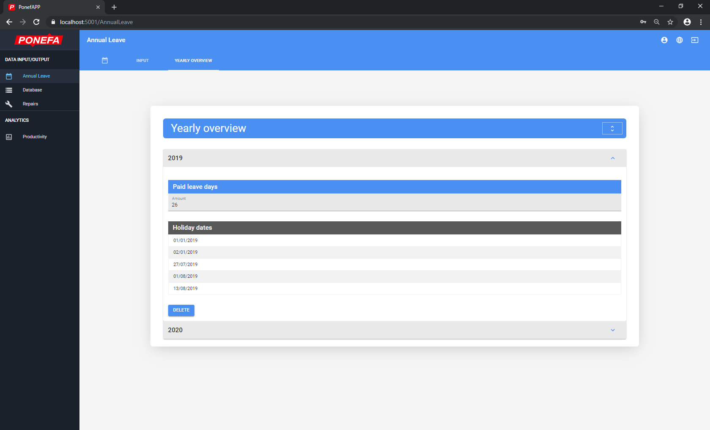

##### August 10, 2019

# PonefAPP
 PonefAPP is a productivty/time-tracking web application I've built for Ponefa, an upholstery business based in Poland. The application uses a .NET Core back-end, a React front-end and a MySQL database.
 
 https://PonefAPP.com
 
 
## Screenshots
 

### User panel

### Admin panel

